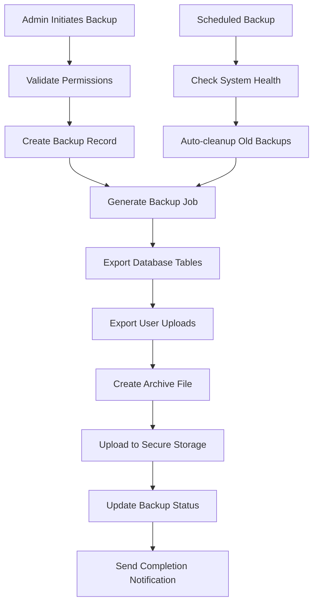

# Admin Backup and Restore System

## Comprehensive Data Backup Architecture

The admin dashboard includes full system backup and restore capabilities for data protection and recovery.

### Backup System Implementation

```typescript
interface BackupMetadata {
  id: string;
  created_at: Date;
  created_by: string;
  type: 'full' | 'partial' | 'scheduled';
  size_bytes: number;
  tables_included: string[];
  status: 'creating' | 'completed' | 'failed';
  file_path: string;
}

export const backupRouter = router({
  create: adminProcedure
    .input(
      z.object({
        type: z.enum(['full', 'partial']),
        tables: z.array(z.string()).optional(),
        description: z.string().optional(),
      })
    )
    .mutation(async ({ input, ctx }) => {
      const backupId = generateBackupId();

      // Create backup record
      const backup = await ctx.db
        .insert(backups)
        .values({
          id: backupId,
          created_by: ctx.user.id,
          type: input.type,
          status: 'creating',
          description: input.description,
        })
        .returning();

      // Queue backup job
      await scheduleBackupJob(backupId, input);

      return backup[0];
    }),

  list: adminProcedure.query(async ({ ctx }) => {
    return await ctx.db.select().from(backups).orderBy(desc(backups.created_at)).limit(50);
  }),

  restore: adminProcedure
    .input(
      z.object({
        backupId: z.string(),
        confirmationCode: z.string(),
      })
    )
    .mutation(async ({ input, ctx }) => {
      // Validate confirmation code
      if (input.confirmationCode !== generateConfirmationCode(input.backupId)) {
        throw new TRPCError({ code: 'UNAUTHORIZED' });
      }

      return await executeRestore(input.backupId, ctx.user.id);
    }),
});
```

### Database Schema for Backups

```sql
CREATE TABLE system_backups (
  id UUID DEFAULT gen_random_uuid() PRIMARY KEY,
  backup_id TEXT UNIQUE NOT NULL,
  created_by UUID NOT NULL REFERENCES admin_users(id),
  backup_type TEXT NOT NULL CHECK (backup_type IN ('full', 'partial', 'scheduled')),
  status TEXT DEFAULT 'creating' CHECK (status IN ('creating', 'completed', 'failed')),
  file_path TEXT,
  file_size_bytes BIGINT,
  tables_included JSONB,
  description TEXT,
  metadata JSONB,
  created_at TIMESTAMPTZ DEFAULT NOW(),
  completed_at TIMESTAMPTZ,
  error_message TEXT
);

CREATE TABLE restore_operations (
  id UUID DEFAULT gen_random_uuid() PRIMARY KEY,
  backup_id TEXT NOT NULL REFERENCES system_backups(backup_id),
  initiated_by UUID NOT NULL REFERENCES admin_users(id),
  status TEXT DEFAULT 'in_progress',
  started_at TIMESTAMPTZ DEFAULT NOW(),
  completed_at TIMESTAMPTZ,
  tables_restored JSONB,
  records_count JSONB,
  error_log TEXT
);
```

### Automated Backup Scheduling

```sql
-- Automated daily backups using pg_cron
SELECT cron.schedule(
  'daily-system-backup',
  '0 2 * * *',  -- Every day at 2 AM
  'SELECT create_scheduled_backup();'
);

-- Automated weekly full backups
SELECT cron.schedule(
  'weekly-full-backup',
  '0 1 * * 0',  -- Every Sunday at 1 AM
  'SELECT create_full_system_backup();'
);
```

### Backup Workflow Architecture



### Restore Process Implementation

```typescript
class RestoreService {
  async executeRestore(backupId: string, adminUserId: string): Promise<void> {
    const backup = await this.getBackupMetadata(backupId);

    if (!backup || backup.status !== 'completed') {
      throw new Error('Invalid backup for restoration');
    }

    // Create restore operation record
    const restoreOp = await this.createRestoreOperation(backupId, adminUserId);

    try {
      // 1. Create database snapshot for rollback
      await this.createPreRestoreSnapshot();

      // 2. Disable RLS temporarily for restore
      await this.disableRLS();

      // 3. Restore data
      await this.restoreFromBackup(backup);

      // 4. Re-enable RLS
      await this.enableRLS();

      // 5. Validate restored data
      await this.validateRestoredData();

      await this.completeRestoreOperation(restoreOp.id);
    } catch (error) {
      await this.rollbackRestore(restoreOp.id, error);
      throw error;
    }
  }
}
```

## Final Status: ARCHITECTURE COMPLETE ✅

This architecture document is production-ready and provides comprehensive guidance for building the Coquinate meal planning platform with cutting-edge technology while maintaining pragmatic, efficient development practices.
