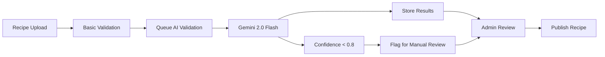

# AI Implementation Architecture

## Overview

Coquinate integrates AI capabilities through Gemini 2.0 Flash for recipe validation, nutritional analysis, and content optimization. This section defines the AI integration architecture within the Supabase Edge Functions environment.

## AI Service Integration Points

### 1. Recipe Validation Pipeline

```typescript
interface RecipeValidationRequest {
  recipeId: string;
  nutritionalData: NutritionInfo;
  ingredients: Ingredient[];
  instructions: string[];
  servings: number;
  difficultyLevel: 'easy' | 'medium' | 'hard';
}

interface RecipeValidationResponse {
  isValid: boolean;
  confidence: number;
  issues: ValidationIssue[];
  suggestions: string[];
  nutritionalCorrections: Partial<NutritionInfo>;
}

interface ValidationIssue {
  type: 'ingredient' | 'instruction' | 'nutrition' | 'timing';
  severity: 'low' | 'medium' | 'high';
  description: string;
  suggestion: string;
}
```

### 2. AI Edge Function Architecture

```typescript
// /supabase/functions/recipe-validation/index.ts
import { google } from '@ai-sdk/google';
import { generateText, streamText } from 'ai';

// AI SDK 4.2 configuration
const aiModel = google('gemini-2.0-flash', {
  apiKey: Deno.env.get('GEMINI_API_KEY')!,
});

export const recipeValidationRouter = router({
  validateRecipe: publicProcedure.input(recipeValidationSchema).mutation(async ({ input }) => {
    const result = await generateText({
      model: aiModel,
      messages: [
        { role: 'system', content: 'You are a Romanian recipe validation expert.' },
        { role: 'user', content: buildValidationPrompt(input) },
      ],
      maxTokens: 1000,
      temperature: 0.3,
    });
    return processValidationResponse(result);
  }),

  optimizeNutrition: publicProcedure
    .input(nutritionOptimizationSchema)
    .mutation(async ({ input }) => {
      // AI SDK 4.2 nutrition optimization with streaming
      const result = await streamText({
        model: aiModel,
        messages: [
          { role: 'system', content: 'You are a nutrition expert for Romanian cuisine.' },
          { role: 'user', content: buildNutritionPrompt(input) },
        ],
        maxTokens: 800,
      });
      return result;
    }),

  generateRecipeSuggestions: publicProcedure.input(suggestionSchema).query(async ({ input }) => {
    // AI SDK 4.2 with message parts for future image support
    const result = await generateText({
      model: aiModel,
      messages: [
        { role: 'system', content: 'You are a creative Romanian chef assistant.' },
        { role: 'user', content: [{ type: 'text', text: buildSuggestionPrompt(input) }] },
      ],
      maxTokens: 1200,
    });
    return result;
  }),
});
```

### 3. AI Database Integration

```sql
-- AI validation results storage (AI SDK 4.2 compatible)
CREATE TABLE validation_results (
  id UUID DEFAULT gen_random_uuid() PRIMARY KEY,
  recipe_id UUID NOT NULL REFERENCES recipes(id),
  validation_type TEXT NOT NULL,
  confidence_score DECIMAL(3,2),
  issues JSONB,
  suggestions JSONB,
  ai_model_version TEXT DEFAULT 'gemini-2.0-flash',
  ai_sdk_version TEXT DEFAULT '4.2',
  token_usage JSONB, -- AI SDK 4.2 usage tracking
  request_id TEXT,   -- AI SDK 4.2 request tracking
  created_at TIMESTAMPTZ DEFAULT NOW(),
  updated_at TIMESTAMPTZ DEFAULT NOW()
);

-- AI processing queue for batch operations (AI SDK 4.2 enhanced)
CREATE TABLE ai_processing_queue (
  id UUID DEFAULT gen_random_uuid() PRIMARY KEY,
  task_type TEXT NOT NULL,
  payload JSONB NOT NULL,
  status TEXT DEFAULT 'pending',
  attempts INTEGER DEFAULT 0,
  max_attempts INTEGER DEFAULT 3,
  ai_sdk_version TEXT DEFAULT '4.2',
  model_used TEXT DEFAULT 'gemini-2.0-flash',
  token_usage JSONB, -- Store AI SDK 4.2 usage stats
  scheduled_at TIMESTAMPTZ DEFAULT NOW(),
  processed_at TIMESTAMPTZ,
  error_message TEXT,
  error_type TEXT, -- AI SDK 4.2 error types
  created_at TIMESTAMPTZ DEFAULT NOW()
);
```

### 4. AI Workflow Integration



## AI Configuration and Limits (Updated 2025)

**AI SDK 4.2 Configuration:**

- **Package**: @ai-sdk/google (AI SDK 4.2 compatible)
- **Model**: gemini-2.0-flash (production-ready, generally available)
- **SDK Version**: AI SDK 4.2 with message parts support
- **Rate Limiting**: Project tier-based (60 req/min default, scales with usage)
- **Timeout**: 30 seconds per validation request
- **Retry Logic**: 3 attempts with exponential backoff (built into AI SDK 4.2)
- **Cost Management**: AI SDK 4.2 built-in caching + local caching for identical requests
- **Streaming**: Enabled with automatic cleanup mechanisms
- **Message Parts**: Enabled for future text + image support

**Environment Configuration:**

```bash
# Updated for AI SDK 4.2 (2025)
GEMINI_API_KEY=your-gemini-api-key-here
GEMINI_MODEL=gemini-2.0-flash  # Updated from gemini-pro
AI_SDK_VERSION=4.2
AI_STREAM_ENABLED=true
AI_MESSAGE_PARTS_ENABLED=true
```

**Migration Notes:**

- ❌ Old: `@google/generative-ai` package
- ✅ New: `@ai-sdk/google` package (AI SDK 4.2)
- ❌ Old: `gemini-pro` model
- ✅ New: `gemini-2.0-flash` model (production-ready)
- ❌ Old: Direct API calls
- ✅ New: AI SDK 4.2 generateText/streamText with message parts
