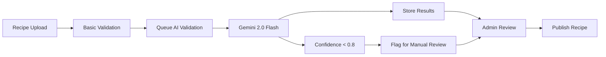

# AI Implementation Architecture

## Overview

Coquinate integrates AI capabilities through Gemini 2.0 Flash for recipe validation, nutritional analysis, and content optimization. This section defines the AI integration architecture within the Supabase Edge Functions environment.

## AI Service Integration Points

### 1. Recipe Validation Pipeline

```typescript
interface RecipeValidationRequest {
  recipeId: string;
  nutritionalData: NutritionInfo;
  ingredients: Ingredient[];
  instructions: string[];
  servings: number;
  difficultyLevel: 'easy' | 'medium' | 'hard';
}

interface RecipeValidationResponse {
  isValid: boolean;
  confidence: number;
  issues: ValidationIssue[];
  suggestions: string[];
  nutritionalCorrections: Partial<NutritionInfo>;
}

interface ValidationIssue {
  type: 'ingredient' | 'instruction' | 'nutrition' | 'timing';
  severity: 'low' | 'medium' | 'high';
  description: string;
  suggestion: string;
}
```

### 2. AI Edge Function Architecture

```typescript
// /supabase/functions/recipe-validation/index.ts
import { GoogleGenerativeAI } from '@google/generative-ai';

const genAI = new GoogleGenerativeAI(Deno.env.get('GEMINI_API_KEY')!);
const model = genAI.getGenerativeModel({ model: 'gemini-2.0-flash' });

export const recipeValidationRouter = router({
  validateRecipe: publicProcedure.input(recipeValidationSchema).mutation(async ({ input }) => {
    const prompt = buildValidationPrompt(input);
    const result = await model.generateContent(prompt);
    return processValidationResponse(result);
  }),

  optimizeNutrition: publicProcedure
    .input(nutritionOptimizationSchema)
    .mutation(async ({ input }) => {
      // AI-powered nutrition optimization
    }),

  generateRecipeSuggestions: publicProcedure.input(suggestionSchema).query(async ({ input }) => {
    // AI-powered recipe suggestions
  }),
});
```

### 3. AI Database Integration

```sql
-- AI validation results storage
CREATE TABLE validation_results (
  id UUID DEFAULT gen_random_uuid() PRIMARY KEY,
  recipe_id UUID NOT NULL REFERENCES recipes(id),
  validation_type TEXT NOT NULL,
  confidence_score DECIMAL(3,2),
  issues JSONB,
  suggestions JSONB,
  ai_model_version TEXT DEFAULT 'gemini-2.0-flash',
  created_at TIMESTAMPTZ DEFAULT NOW(),
  updated_at TIMESTAMPTZ DEFAULT NOW()
);

-- AI processing queue for batch operations
CREATE TABLE ai_processing_queue (
  id UUID DEFAULT gen_random_uuid() PRIMARY KEY,
  task_type TEXT NOT NULL,
  payload JSONB NOT NULL,
  status TEXT DEFAULT 'pending',
  attempts INTEGER DEFAULT 0,
  max_attempts INTEGER DEFAULT 3,
  scheduled_at TIMESTAMPTZ DEFAULT NOW(),
  processed_at TIMESTAMPTZ,
  error_message TEXT,
  created_at TIMESTAMPTZ DEFAULT NOW()
);
```

### 4. AI Workflow Integration



## AI Configuration and Limits

- **Model**: Gemini 2.0 Flash (latest stable)
- **Rate Limiting**: 60 requests/minute per API key
- **Timeout**: 30 seconds per validation request
- **Retry Logic**: 3 attempts with exponential backoff
- **Cost Management**: Cached results for identical validation requests
