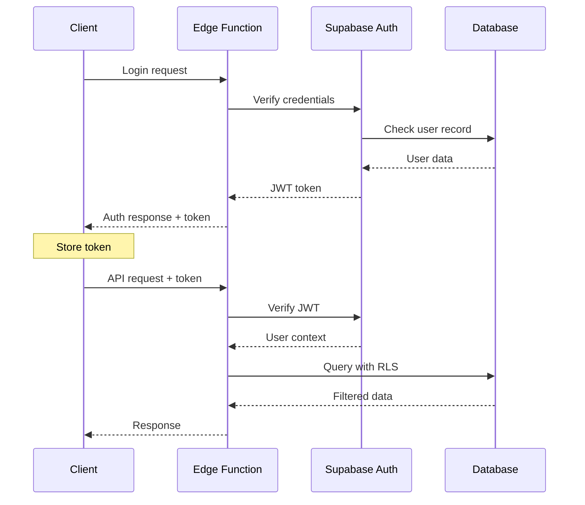

# Backend Architecture

## Service Architecture

### Function Organization

```
supabase/functions/
├── _shared/              # Shared utilities
│   ├── cors.ts
│   ├── auth.ts
│   ├── database.ts
│   └── validation.ts
├── auth/                # Auth endpoints
│   └── index.ts
├── meal-plans/         # Meal plan endpoints
│   └── index.ts
├── recipes/           # Recipe endpoints
│   └── index.ts
├── shopping/          # Shopping list endpoints
│   └── index.ts
├── subscriptions/     # Subscription endpoints
│   └── index.ts
├── admin/            # Admin endpoints
│   └── index.ts
└── scheduled/        # Cron jobs
    ├── publish-plans/
    └── send-reminders/
```

### Edge Function Architecture

Edge Functions handle API routes with standard patterns:

- CORS handling for all requests
- JWT verification using shared auth utilities
- Supabase client creation with user context
- RLS-enabled database queries
- Standardized error response format

## Database Architecture

### Schema Design

```sql
-- Row Level Security for multi-tenancy
ALTER TABLE users ENABLE ROW LEVEL SECURITY;
ALTER TABLE meal_plans ENABLE ROW LEVEL SECURITY;
ALTER TABLE shopping_lists ENABLE ROW LEVEL SECURITY;

-- User can only see their own data
CREATE POLICY "Users can view own data" ON users
  FOR SELECT USING (auth.uid() = id);

CREATE POLICY "Users can update own data" ON users
  FOR UPDATE USING (auth.uid() = id);

-- Meal plans belong to users
CREATE POLICY "Users can view own meal plans" ON meal_plans
  FOR ALL USING (auth.uid() = user_id);

-- Public recipes are viewable by all
CREATE POLICY "Published recipes are public" ON recipes
  FOR SELECT USING (status = 'published');

-- Admin policies (separate admin role check)
CREATE POLICY "Admins can manage all recipes" ON recipes
  FOR ALL USING (
    EXISTS (
      SELECT 1 FROM admin_users
      WHERE admin_users.id = auth.uid()
    )
  );
```

### Database Access Patterns

Repository classes provide typed database access using Supabase client. Repositories handle joins, filtering, and error handling for complex queries while maintaining type safety.

## Authentication and Authorization

### Auth Flow



### Authentication Middleware

Shared authentication utilities verify JWT tokens and check admin permissions. Middleware functions return auth context with user information for protected endpoints.
