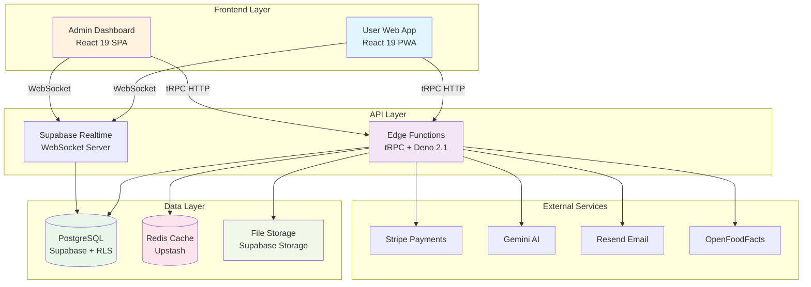
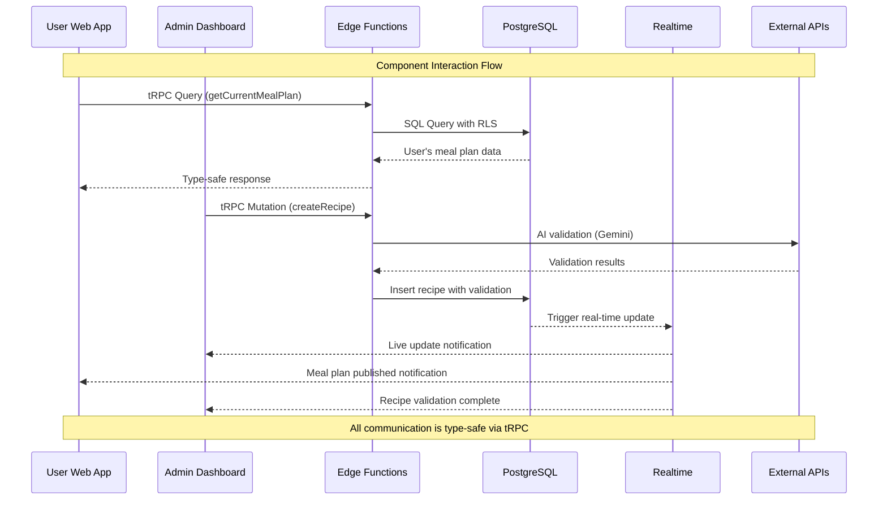
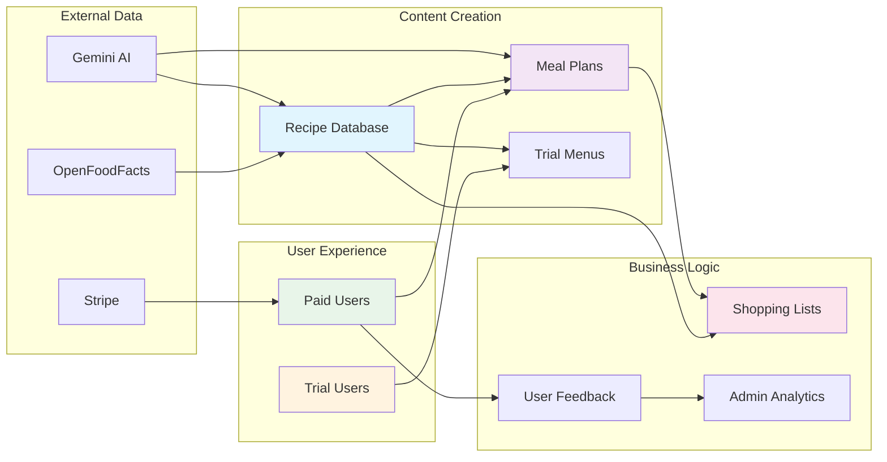
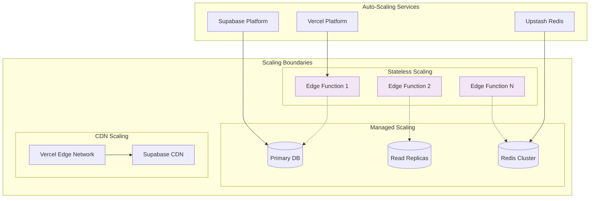

# Components

## User-Facing Web Application

**Responsibility:** Main React 19 PWA for Romanian families to access meal plans, recipes, and shopping lists.

**Key Interfaces:**

- tRPC client for type-safe API calls
- Standard auto-save with 60-second intervals (FR16)
- Service Worker for offline support
- Zustand stores for state management

**Dependencies:** tRPC router, Supabase client, Stripe checkout

**Technology Stack:** React 19.1.0, TypeScript 5.9, Vite 7.0, Tailwind 4.1, shadcn/ui, PWA manifest

## Admin Dashboard

**Responsibility:** Mission-critical admin interface for single operator to manage recipes, create meal plans, and monitor analytics.

**Key Interfaces:**

- Admin-specific tRPC endpoints
- Real-time validation feedback via WebSockets
- Auto-save functionality (every 60s server, 10s local)
- AI integration for recipe/plan generation

**Dependencies:** Admin auth service, AI validation service, publishing scheduler

**Technology Stack:** React 19.1.0, TypeScript 5.9, TanStack Table 8.x, Recharts for analytics

## Edge Functions API

**Responsibility:** Serverless backend running on Supabase Edge Functions (Deno runtime) handling all business logic.

**Key Interfaces:**

- tRPC routers for all API endpoints
- Supabase client for database access
- External API integrations (Stripe, Gemini, Resend)
- Scheduled jobs via pg_cron

**Dependencies:** PostgreSQL database, Redis cache, external services

**Technology Stack:** Deno 2.1+, TypeScript 5.9, tRPC 11.4.3, Supabase JS 2.54

## Database Layer

**Responsibility:** PostgreSQL database with Row Level Security managing all application data.

**Key Interfaces:**

- Direct SQL access from Edge Functions
- RLS policies for multi-tenant isolation
- HTTP-based auto-save API calls
- pg_cron for scheduled tasks

**Dependencies:** None (foundational layer)

**Technology Stack:** PostgreSQL 15.x, Supabase platform, RLS policies

## Caching Layer

**Responsibility:** Upstash Redis for Vercel AI SDK response caching only (as per PRD).

**Key Interfaces:**

- Edge-compatible Redis client
- TTL-based cache invalidation
- Session storage for auth

**Dependencies:** Edge Functions

**Technology Stack:** Upstash Redis (serverless)

## File Storage

**Responsibility:** Supabase Storage for recipe images and PDF exports.

**Key Interfaces:**

- Authenticated upload/download URLs
- Image transformation API
- CDN distribution

**Dependencies:** Auth service for access control

**Technology Stack:** Supabase Storage with built-in CDN

## Component Relationship Diagrams

The following diagrams illustrate the relationships and data flow between major system components:

### High-Level Component Dependencies

### Component Communication Patterns

### Data Flow Architecture

### Component Scaling Strategy

These diagrams illustrate the key architectural decisions:

1. **Clean Separation**: Frontend, API, and Data layers are clearly separated
2. **Type Safety**: tRPC ensures type safety across all component boundaries
3. **Standard Auto-Save**: HTTP-based periodic saves per FR16 requirement
4. **Auto-Scaling**: Serverless components scale automatically
5. **External Integration**: Clean interfaces to third-party services
