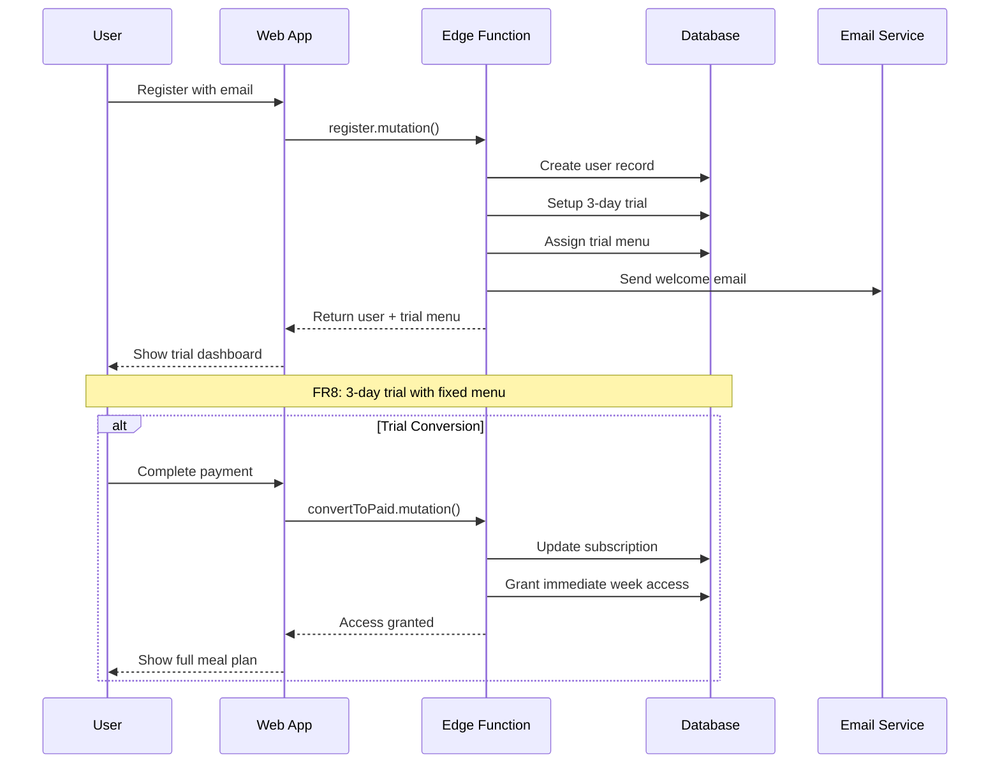
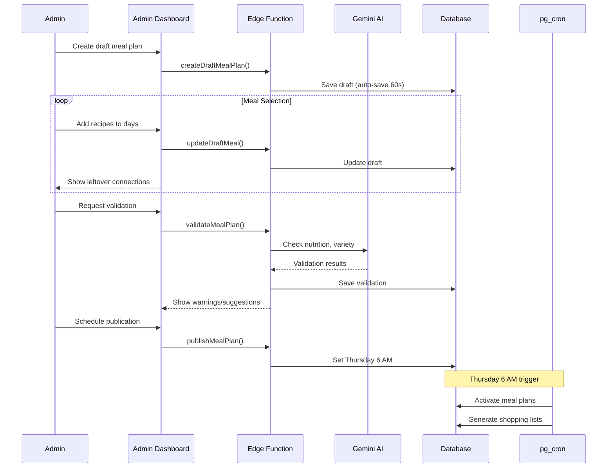

# Core Workflows

## User Registration and Trial Flow



## Weekly Meal Plan Generation and Publishing



## Shopping List Generation with Ingredient Lookup

```mermaid
sequenceDiagram
    participant U as User
    participant W as Web App
    participant API as Edge Function
    participant DB as Database
    participant OFF as OpenFoodFacts
    participant PDF as PDF Service

    U->>W: View shopping list
    W->>API: getCurrentShoppingList()

    API->>DB: Get week's recipes
    API->>DB: Get recipe ingredients

    loop For each ingredient
        API->>DB: Check local ingredients table
        alt Not found locally
            API->>OFF: Search ingredient
            OFF-->>API: Nutrition data
            API->>DB: Cache ingredient
        end
    end

    API->>API: Aggregate quantities
    API->>API: Apply custom categories
    API-->>W: Categorized shopping list
    W-->>U: Display list

    alt Export PDF
        U->>W: Export as PDF
        W->>API: exportPDF()
        API->>PDF: Generate PDF
        PDF-->>API: PDF URL
        API-->>W: Download link
        W-->>U: Download PDF
    end
```
