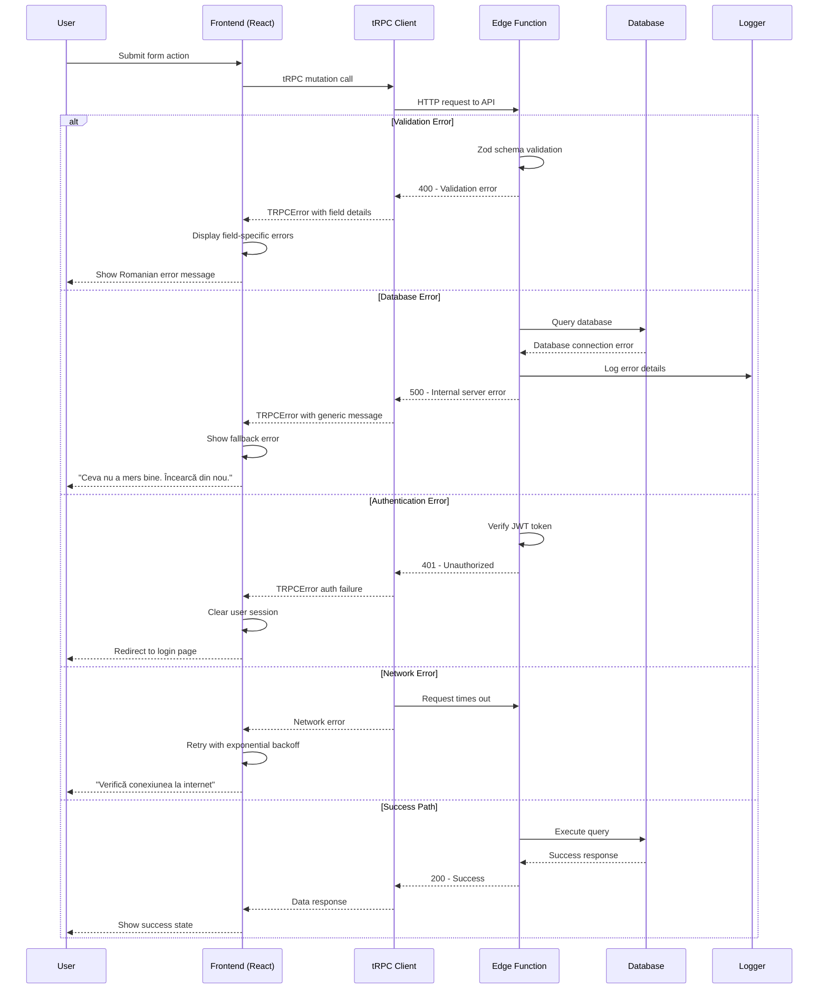
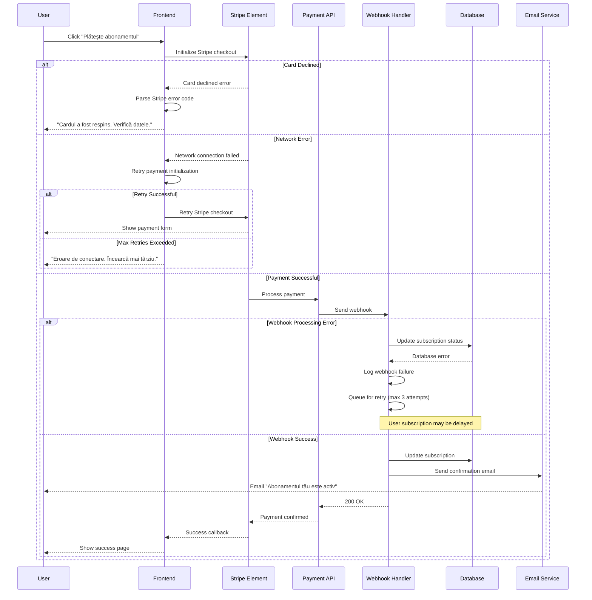
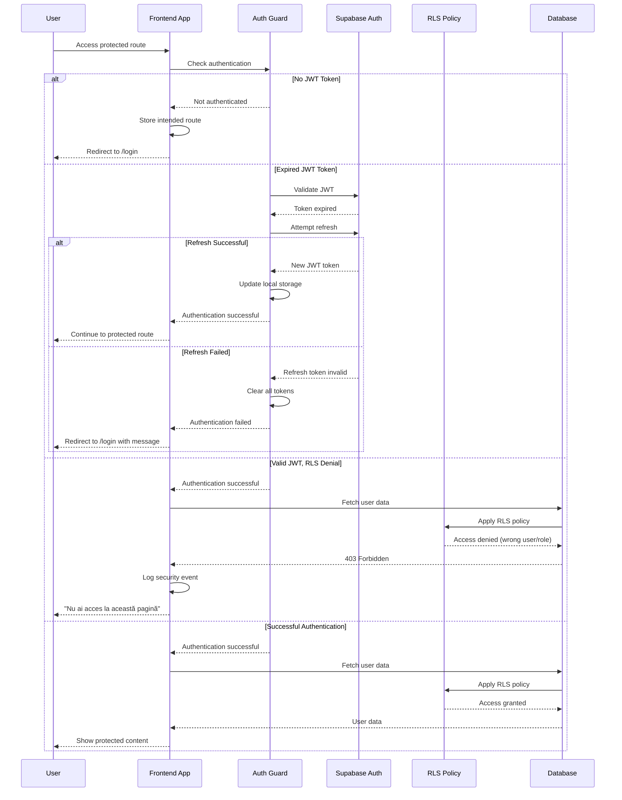
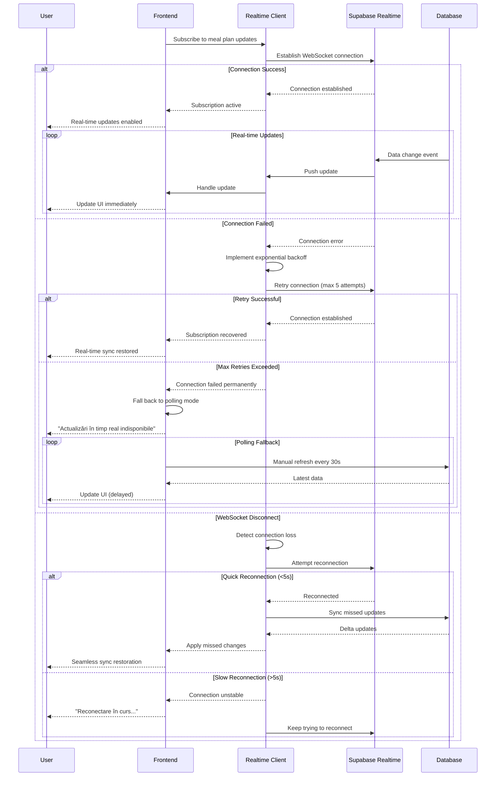

# Error Handling

## Simple Error Handling Approach

**Frontend:**

- tRPC handles API errors automatically
- Show user-friendly messages in Romanian/English
- Console.error() for debugging in development

**Backend:**

- Zod validation errors return field-specific messages
- Supabase errors are caught and logged
- Generic "Something went wrong" for unexpected errors

## Error Messages

Bilingual error messages provide user-friendly feedback in Romanian and English for common error scenarios including authentication, validation, network, and generic errors.

**Note:** Vercel provides automatic error tracking. No need for complex error handling infrastructure.

## Error Flow Sequence Diagrams

### API Error Handling Flow

This diagram shows how errors propagate through the fullstack system from the backend to the frontend:

### Payment Error Handling Flow

This diagram shows error handling for the critical payment flow:

### Authentication Error Handling Flow

This diagram shows how authentication errors are handled across the application:

### Real-time Error Handling Flow

This diagram shows error handling for Supabase Realtime subscriptions:

