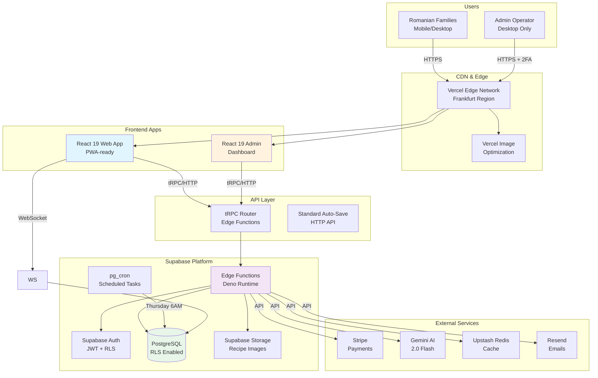

# High Level Architecture

## Technical Summary

Coquinate is a serverless-first, event-driven architecture deployed on Vercel with Supabase as the backend platform. The frontend uses React 19 (stable) with TypeScript in a Vite-powered monorepo, while the backend leverages Supabase Edge Functions (Deno runtime) with PostgreSQL. The platform connects frontend and backend through tRPC over HTTP for type-safe API calls, with standard auto-save functionality. Infrastructure is managed through Vercel and Supabase platforms, achieving the PRD's goal of minimal DevOps overhead while maintaining scalability for the Romanian market's 4.8M potential users.

## Platform and Infrastructure Choice

**Platform:** Vercel + Supabase Hybrid Architecture
**Key Services:**

- Vercel: Static hosting, Image Optimization, Edge Network, Analytics
- Supabase: PostgreSQL, Auth, Storage, Edge Functions, Vector embeddings
  **Deployment Host and Regions:**
- Vercel: Global Edge Network (closest edge to Romania: Frankfurt)
- Supabase: EU-Central (Frankfurt) for GDPR compliance and low latency

## Repository Structure

**Structure:** Monorepo with pnpm workspaces
**Monorepo Tool:** pnpm workspaces (built-in, no Nx/Turborepo overhead)
**Package Organization:**

- Apps isolation (web, admin, edge-functions)
- Shared packages for types, UI, database schemas
- Clear dependency boundaries with workspace protocol

## High Level Architecture Diagram

## Architectural Patterns

- **Jamstack Architecture:** Static generation with dynamic API routes - _Rationale:_ Optimal performance and SEO for marketing pages while maintaining dynamic functionality
- **Edge-First Compute:** Deno Edge Functions for API logic - _Rationale:_ Lower latency for Romanian users, automatic scaling, no cold starts
- **Component-Based UI:** React 19 with Server Components where beneficial - _Rationale:_ Better performance with streaming SSR, reduced bundle size
- **API Gateway Pattern:** tRPC as single entry point for all API calls - _Rationale:_ Type safety across stack, automatic client generation
- **Standard Auto-Save:** Local draft storage with periodic saves - _Rationale:_ FR16 explicitly prohibits real-time collaboration
- **Offline-First PWA:** Service Worker with cache-first strategy - _Rationale:_ Handle Romanian mobile network inconsistencies

## Technical Reality Check (August 2025)

- **React 19:** Now stable and production-ready with full ecosystem support
- **Tailwind v4:** Stable release with native CSS variables, full shadcn/ui compatibility
- **Database Access:** Pure Supabase with native TypeScript types - no ORM needed
- **Deno Edge Functions:** Mature and stable, excellent performance
- **tRPC:** v11 with improved Edge runtime support
