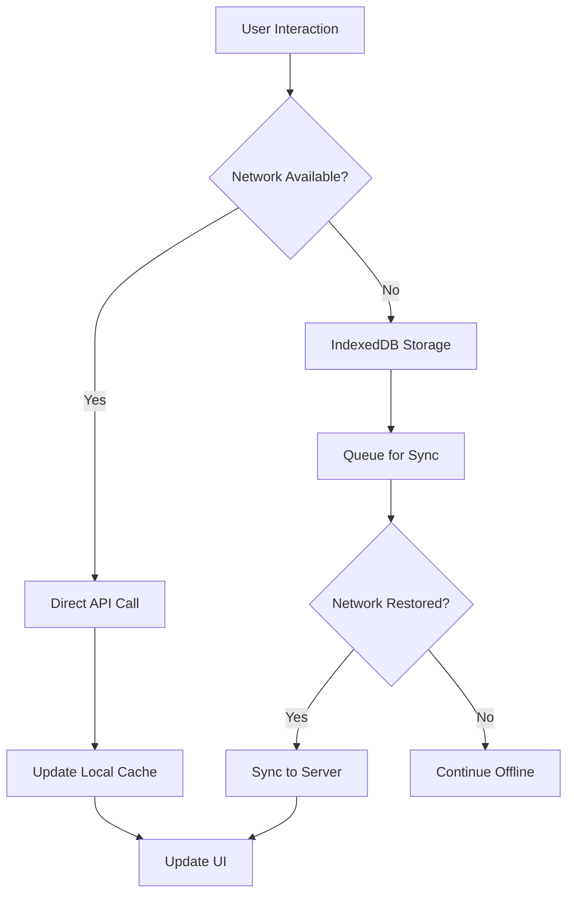

# PWA and Offline Support Architecture

## Progressive Web App Implementation

Coquinate provides offline-first meal planning capabilities using modern PWA technologies.

### PWA Configuration

```typescript
// vite.config.ts - PWA setup
import { VitePWA } from 'vite-plugin-pwa';

export default defineConfig({
  plugins: [
    react(),
    VitePWA({
      registerType: 'autoUpdate',
      workbox: {
        globPatterns: ['**/*.{js,css,html,ico,png,svg,woff2}'],
        runtimeCaching: [
          {
            urlPattern: /^https:\/\/.*\.supabase\.co\/storage\/v1\/object\/public\/.*/,
            handler: 'CacheFirst',
            options: {
              cacheName: 'recipe-images',
              expiration: { maxEntries: 100, maxAgeSeconds: 60 * 60 * 24 * 30 },
            },
          },
        ],
      },
      manifest: {
        name: 'Coquinate - Meal Planning',
        short_name: 'Coquinate',
        description: 'Smart meal planning for Romanian families',
        theme_color: '#10b981',
        background_color: '#ffffff',
        display: 'standalone',
        scope: '/',
        start_url: '/',
        icons: [
          { src: 'pwa-192x192.png', sizes: '192x192', type: 'image/png' },
          { src: 'pwa-512x512.png', sizes: '512x512', type: 'image/png' },
        ],
      },
    }),
  ],
});
```

### Offline Data Storage

```typescript
interface OfflineStorage {
  recipes: {
    id: string;
    title: string;
    ingredients: Ingredient[];
    instructions: string[];
    cached_at: Date;
  }[];
  shoppingLists: {
    id: string;
    items: ShoppingItem[];
    synced: boolean;
  }[];
  userProgress: {
    mealId: string;
    completed: boolean;
    notes: string;
  }[];
}

// Offline storage service using IndexedDB
class OfflineStorageService {
  private db: IDBDatabase;

  async cacheRecipes(recipes: Recipe[]): Promise<void> {
    const tx = this.db.transaction(['recipes'], 'readwrite');
    const store = tx.objectStore('recipes');

    for (const recipe of recipes) {
      await store.put({
        ...recipe,
        cached_at: new Date(),
      });
    }
  }

  async syncWhenOnline(): Promise<void> {
    if (navigator.onLine) {
      await this.syncPendingChanges();
      await this.fetchLatestData();
    }
  }
}
```

### Offline-First Architecture


