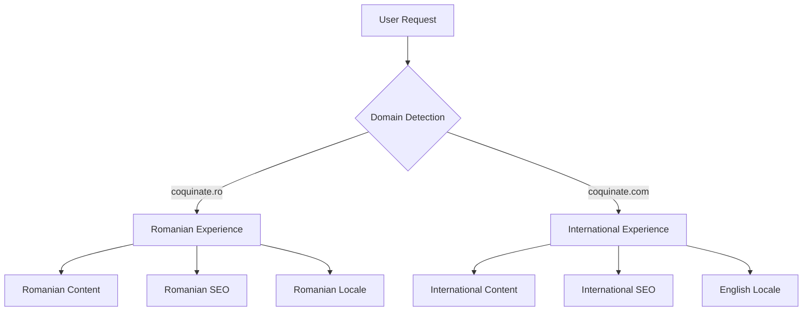

# Coquinate UI/UX Specification

## Table of Contents

- [Coquinate UI/UX Specification](#table-of-contents)
  - [Introduction](./introduction.md)
    - [Overall UX Goals & Principles](./introduction.md#overall-ux-goals-principles)
      - [Target User Personas](./introduction.md#target-user-personas)
      - [Usability Goals](./introduction.md#usability-goals)
      - [Design Principles](./introduction.md#design-principles)
    - [Mental Models & Expectations](./introduction.md#mental-models-expectations)
      - [Food Delivery Apps (Glovo, Tazz)](./introduction.md#food-delivery-apps-glovo-tazz)
      - [Banking Apps (George, BT Pay)](./introduction.md#banking-apps-george-bt-pay)
      - [Shopping List Apps](./introduction.md#shopping-list-apps)
    - [Emotional Journey & Value Proposition](./introduction.md#emotional-journey-value-proposition)
      - [Core Value Beyond Money](./introduction.md#core-value-beyond-money)
      - [Key Emotional Moments](./introduction.md#key-emotional-moments)
      - [Savings Display Strategy](./introduction.md#savings-display-strategy)
    - [Key UI Requirements (PRD-Aligned)](./introduction.md#key-ui-requirements-prd-aligned)
      - [Mobile Interactions](./introduction.md#mobile-interactions)
      - [Feedback System](./introduction.md#feedback-system)
      - [Core Navigation](./introduction.md#core-navigation)
      - [Visual Feedback](./introduction.md#visual-feedback)
    - [Pain Point Solutions (PRD-Focused)](./introduction.md#pain-point-solutions-prd-focused)
      - [Decision Fatigue Solution](./introduction.md#decision-fatigue-solution)
      - [Evening Panic Solution](./introduction.md#evening-panic-solution)
      - [Shopping Efficiency Solution](./introduction.md#shopping-efficiency-solution)
      - [System Notifications (per PRD)](./introduction.md#system-notifications-per-prd)
    - [Success Metrics Definition](./introduction.md#success-metrics-definition)
      - [Measurable UX Metrics](./introduction.md#measurable-ux-metrics)
      - [What We Cannot Measure](./introduction.md#what-we-cannot-measure)
    - [Admin Dashboard UI Patterns (PRD-Aligned)](./introduction.md#admin-dashboard-ui-patterns-prd-aligned)
      - [Navigation & Status](./introduction.md#navigation-status)
      - [Meal Plan Builder](./introduction.md#meal-plan-builder)
      - [Validation System](./introduction.md#validation-system)
      - [AI Integration](./introduction.md#ai-integration)
      - [Testing Mode](./introduction.md#testing-mode)
    - [Change Log](./introduction.md#change-log)
  - [Information Architecture (IA)](./information-architecture-ia.md)
    - [Site Map / Screen Inventory (Refined)](./information-architecture-ia.md#site-map-screen-inventory-refined)
    - [Navigation Structure (Refined)](./information-architecture-ia.md#navigation-structure-refined)
    - [Information Hierarchy](./information-architecture-ia.md#information-hierarchy)
    - [Critical IA Decisions (Preventing Future Regrets)](./information-architecture-ia.md#critical-ia-decisions-preventing-future-regrets)
  - **[User Application Wireframes](./USER-APP-WIREFRAMES.md)** ⭐
    - [Week View Dashboard](./USER-APP-WIREFRAMES.md#week-view-dashboard)
    - [Today Focus View](./USER-APP-WIREFRAMES.md#today-focus-view)
    - [Shopping List Interface](./USER-APP-WIREFRAMES.md#shopping-list-interface)
    - [Recipe Detail View](./USER-APP-WIREFRAMES.md#recipe-detail-view)
    - [Account Settings Screen](./USER-APP-WIREFRAMES.md#account-settings-screen)
    - [Onboarding Flow](./USER-APP-WIREFRAMES.md#onboarding-flow)
    - [Loading & Error States](./USER-APP-WIREFRAMES.md#loading-error-states)
    - [Mobile & Desktop Layouts](./USER-APP-WIREFRAMES.md#responsive-layouts)
  - **[Admin Dashboard Wireframes](./ADMIN-DASHBOARD-WIREFRAMES.md)** 🔧
    - [Admin Meal Plan Builder](./ADMIN-DASHBOARD-WIREFRAMES.md#admin-meal-plan-builder)
    - [Recipe Testing Mode](./ADMIN-DASHBOARD-WIREFRAMES.md#recipe-testing-mode)
    - [Recipe Management Interface](./ADMIN-DASHBOARD-WIREFRAMES.md#recipe-management-interface)
    - [Ingredient Database Lookup](./ADMIN-DASHBOARD-WIREFRAMES.md#ingredient-database-lookup)
    - [Validation Dashboard](./ADMIN-DASHBOARD-WIREFRAMES.md#validation-dashboard)
    - [Analytics & Reports](./ADMIN-DASHBOARD-WIREFRAMES.md#analytics-reports)
    - [Emergency Operations](./ADMIN-DASHBOARD-WIREFRAMES.md#emergency-operations)
  - **[Marketing Website Wireframes](./MARKETING-WEBSITE-WIREFRAMES.md)** 🌐
    - [Homepage Layout](./MARKETING-WEBSITE-WIREFRAMES.md#homepage-layout)
    - [Hero Section](./MARKETING-WEBSITE-WIREFRAMES.md#hero-section)
    - [How It Works Section](./MARKETING-WEBSITE-WIREFRAMES.md#how-it-works-section)
    - [Pricing Section](./MARKETING-WEBSITE-WIREFRAMES.md#pricing-section)
    - [Required Pages Structure](./MARKETING-WEBSITE-WIREFRAMES.md#required-pages)
  - [User Flows](./user-flows.md)
    - [Critical User Flows](./user-flows.md#critical-user-flows)
      - [Flow 1: Trial to Paid Conversion](./user-flows.md#flow-1-trial-to-paid-conversion)
      - [Flow 2: Weekly Meal Planning Routine](./user-flows.md#flow-2-weekly-meal-planning-routine)
      - [Flow 3: Free Trial Experience](./user-flows.md#flow-3-free-trial-experience)
      - [Flow 4: Subscription & Payment](./user-flows.md#flow-4-subscription-payment)
      - [Flow 5: Admin Meal Planning](./user-flows.md#flow-5-admin-meal-planning)
  - **[Unified Design System](./UNIFIED-DESIGN-SYSTEM.md)** 🎨
    - [Design Tokens (OKLCH Colors)](./UNIFIED-DESIGN-SYSTEM.md#design-tokens)
    - [Complete Component Library](./UNIFIED-DESIGN-SYSTEM.md#component-library)
    - [Implementation Guide](./UNIFIED-DESIGN-SYSTEM.md#implementation-guide)
    - [Typography & Spacing](./UNIFIED-DESIGN-SYSTEM.md#typography-scale)
    - [Context-Aware Colors](./UNIFIED-DESIGN-SYSTEM.md#context-aware-color-modes)
    - [Romanian Localization](./UNIFIED-DESIGN-SYSTEM.md#romanian-localization)
  - **[Component Technical Reference](./COMPONENT-TECHNICAL-REFERENCE.md)** 🔧
    - [Implementation Specifications](./COMPONENT-TECHNICAL-REFERENCE.md#component-implementation-specifications)
    - [Props & TypeScript Interfaces](./COMPONENT-TECHNICAL-REFERENCE.md#app-specific-components)
    - [Usage Guidelines & States](./COMPONENT-TECHNICAL-REFERENCE.md#form-components)
    - [Detailed Component Specs](./COMPONENT-TECHNICAL-REFERENCE.md#component-implementation-specifications)
  - **[Storybook Development Setup](./STORYBOOK-PRACTICAL-SETUP.md)** 🚀
    - [9-Phase Implementation Guide](./STORYBOOK-PRACTICAL-SETUP.md#faza-1-setup-si-configurare-de-baza-30-minute)
    - [Story-Driven Development Workflow](./STORYBOOK-PRACTICAL-SETUP.md#faza-4-workflow-cu-ai-si-commands-15-minute)
    - [MSW API Mocking Strategy](./STORYBOOK-PRACTICAL-SETUP.md#faza-3-msw-mocking-si-page-stories-25-minute)
    - [Component Generator (Plop)](./STORYBOOK-PRACTICAL-SETUP.md#appendix-generator-automat-bonus-20-minute)
  - [Branding & Style Guide](./branding-style-guide.md)
    - [Visual Identity](./branding-style-guide.md#visual-identity)
    - [Context-Aware Color System](./branding-style-guide.md#context-aware-color-system)
      - [Mode-Based Palettes](./branding-style-guide.md#mode-based-palettes)
      - [Food Freshness Indicators](./branding-style-guide.md#food-freshness-indicators)
    - [Typography](./branding-style-guide.md#typography)
      - [Font Stack Strategy](./branding-style-guide.md#font-stack-strategy)
      - [Context-Aware Type Scale](./branding-style-guide.md#context-aware-type-scale)
    - [Iconography](./branding-style-guide.md#iconography)
      - [Primary Icon System](./branding-style-guide.md#primary-icon-system)
      - [Food & Kitchen Specific Icons](./branding-style-guide.md#food-kitchen-specific-icons)
    - [Spacing & Touch Targets](./branding-style-guide.md#spacing-touch-targets)
      - [The Grocery Store Test](./branding-style-guide.md#the-grocery-store-test)
      - [Spacing Scale](./branding-style-guide.md#spacing-scale)
    - [Motion & Feedback](./branding-style-guide.md#motion-feedback)
      - [Micro-interactions](./branding-style-guide.md#micro-interactions)
    - [Accessibility Overlays](./branding-style-guide.md#accessibility-overlays)
      - [High Contrast Mode](./branding-style-guide.md#high-contrast-mode)
      - [Focus Indicators](./branding-style-guide.md#focus-indicators)
    - [Sustainability Visual Language](./branding-style-guide.md#sustainability-visual-language)
      - [Visual Indicators](./branding-style-guide.md#visual-indicators)
    - [Performance Constraints](./branding-style-guide.md#performance-constraints)
      - [Image Loading Strategy](./branding-style-guide.md#image-loading-strategy)
  - [Accessibility Requirements](./accessibility-requirements.md)
    - [Compliance Target](./accessibility-requirements.md#compliance-target)
    - [Critical Requirements Only](./accessibility-requirements.md#critical-requirements-only)
    - [Testing Strategy](./accessibility-requirements.md#testing-strategy)
  - [Responsiveness Strategy](./responsiveness-strategy.md)
    - [Core Approach: Hybrid Smart Defaults](./responsiveness-strategy.md#core-approach-hybrid-smart-defaults)
    - [Breakpoints](./responsiveness-strategy.md#breakpoints)
    - [Implementation Patterns](./responsiveness-strategy.md#implementation-patterns)
  - [Animation & Micro-interactions](./animation-micro-interactions.md)
    - [Motion Principles](./animation-micro-interactions.md#motion-principles)
    - [Core Animations](./animation-micro-interactions.md#core-animations)
    - [Implementation](./animation-micro-interactions.md#implementation)
    - [Explicitly NOT Doing](./animation-micro-interactions.md#explicitly-not-doing)
  - [Performance Considerations](./performance-considerations.md)
    - [Performance Goals](./performance-considerations.md#performance-goals)
    - [Design Strategies](./performance-considerations.md#design-strategies)
    - [What We're NOT Doing](./performance-considerations.md#what-were-not-doing)
  - [Next Steps](./next-steps.md)
    - [Immediate Actions](./next-steps.md#immediate-actions)
    - [Design Handoff Checklist](./next-steps.md#design-handoff-checklist)
    - [Tech Stack Decisions (Confirmed)](./next-steps.md#tech-stack-decisions-confirmed)
    - [Open Architectural Questions for Design Architect](./next-steps.md#open-architectural-questions-for-design-architect)
  - **[Multi-Domain Considerations](#multi-domain-considerations)** 🌐
    - [Domain Strategy Overview](#domain-strategy-overview)
    - [Domain-Specific UI Considerations](#domain-specific-ui-considerations)
    - [SEO and Metadata Management](#seo-and-metadata-management)
    - [Domain Detection Utilities](#domain-detection-utilities)
    - [Implementation Guidelines](#implementation-guidelines)

---

## Multi-Domain Considerations

### Domain Strategy Overview

Coquinate operează pe două domenii principale pentru a deservi diferite piețe și audiențe:

#### Primary Domains
- **coquinate.ro** - Domeniul principal pentru piața românească
  - Target: Utilizatori români
  - Limba principală: Română (ro-RO)
  - Conținut: Rețete românești, ingrediente locale, prețuri în RON
  - SEO Focus: Cuvinte cheie românești pentru planificare mese

- **coquinate.com** - Domeniul internațional pentru expansiune
  - Target: Utilizatori internaționali (viitoare implementare)
  - Limba principală: Engleză (en-US)
  - Conținut: Rețete internaționale, ingrediente generale
  - SEO Focus: Cuvinte cheie engleze pentru meal planning

#### Domain Architecture


### Domain-Specific UI Considerations

#### Romanian Domain (.ro) Specifics
- **Typography**: Suport complet pentru diacritice românești (ă, â, î, ș, ț)
- **Currency**: Afișare prețuri în RON cu formatare românească
- **Date Format**: DD.MM.YYYY (format european)
- **Cultural Context**: 
  - Rețete tradiționale românești în evidență
  - Categorii de alimente specifice (ex: "Băuturi tradiționale")
  - Terminologie culinară românească

#### International Domain (.com) Considerations
- **Typography**: Focus pe Latin Extended pentru suport internațional
- **Currency**: Flexible currency display (USD/EUR based on region)
- **Date Format**: MM/DD/YYYY sau DD/MM/YYYY based on locale detection
- **Cultural Context**: 
  - International recipes as primary content
  - Generic food categories
  - International culinary terminology

### SEO and Metadata Management

#### Canonical URLs and Hreflang
```typescript
// Implemented in apps/web/src/app/layout.tsx
alternates: {
  canonical: '/',
  languages: {
    'ro-RO': 'https://coquinate.ro',
    'en-US': 'https://coquinate.com',
  },
}
```

#### Sitemap Configuration
Both domains have dedicated sitemaps:
- `https://coquinate.ro/sitemap.xml` - Romanian content
- `https://coquinate.com/sitemap.xml` - International content

#### Robots.txt Strategy
Unified robots.txt supports both domains with appropriate crawl directives:
```
# Located: apps/web/public/robots.txt
Sitemap: https://coquinate.ro/sitemap.xml
Sitemap: https://coquinate.com/sitemap.xml
```

#### Meta Tags Strategy
Domain-specific metadata implemented via:
```typescript
// Environment-based configuration
metadataBase: new URL(process.env.NEXT_PUBLIC_SITE_URL || 'https://coquinate.ro')

// Domain-specific OpenGraph
openGraph: {
  locale: domain === 'ro' ? 'ro_RO' : 'en_US',
  url: getCanonicalUrl(pathname, domain),
}
```

### Domain Detection Utilities

#### Core Domain Utils (`apps/web/src/lib/domain-utils.ts`)

```typescript
// Domain detection from headers
export function getDomain(headers?: Headers): 'ro' | 'com' {
  const host = headers.get('host') || '';
  return host.includes('coquinate.com') ? 'com' : 'ro';
}

// Canonical URL generation
export function getCanonicalUrl(pathname: string, domain?: 'ro' | 'com'): string {
  const baseDomain = domain === 'com' 
    ? 'https://coquinate.com' 
    : 'https://coquinate.ro';
  return `${baseDomain}${pathname}`;
}

// Alternate URLs for hreflang
export function getAlternateUrls(pathname: string) {
  return {
    ro: `https://coquinate.ro${pathname}`,
    com: `https://coquinate.com${pathname}`,
  };
}
```

#### Environment Configuration
```bash
# Primary domain configuration
NEXT_PUBLIC_SITE_URL=https://coquinate.ro      # Primary Romanian
NEXT_PUBLIC_SITE_URL_ALT=https://coquinate.com # International alternative
```

### Implementation Guidelines

#### 1. Component Development
- **Always use domain-aware URLs** in components
- **Never hardcode domain names** in components
- **Use `getCanonicalUrl()` for internal links**

```tsx
// GOOD - Domain-aware link
import { getCanonicalUrl } from '@/lib/domain-utils';

const MyComponent = () => {
  const recipeUrl = getCanonicalUrl('/retete/papanasi');
  return <Link href={recipeUrl}>Papanași</Link>;
}

// BAD - Hardcoded domain
const BadComponent = () => (
  <Link href="https://coquinate.ro/retete/papanasi">Papanași</Link>
);
```

#### 2. Content Localization
- **Romanian Domain (.ro)**:
  - All content must use Romanian i18n keys
  - Apply `.text-romanian` CSS class for proper typography
  - Use `romanianUtils` from design tokens for formatting

- **International Domain (.com)**:
  - Content should fall back to English
  - Use international formatting utilities
  - Generic cultural references

#### 3. SEO Implementation
- **Always generate hreflang tags** for both domains
- **Use structured data** with correct domain URLs
- **Implement proper canonical tags** to prevent duplicate content issues

```tsx
// Example: Domain-aware structured data
const getStructuredData = (domain: 'ro' | 'com') => ({
  "@type": "WebSite",
  "url": domain === 'ro' ? "https://coquinate.ro" : "https://coquinate.com",
  "name": domain === 'ro' ? "Coquinate - Planificare Mese" : "Coquinate - Meal Planning"
});
```

#### 4. Email and Communications
- **Domain-specific email addresses**:
  - `contact@coquinate.ro` - Romanian support
  - `support@coquinate.com` - International support
  - `admin@coquinate.ro` - Admin notifications (Romanian primary)

#### 5. Analytics and Tracking
- **Separate tracking** for each domain to analyze market performance
- **Domain-specific conversion funnels** to understand user behavior
- **Regional performance metrics** for feature rollout decisions

#### 6. Future Considerations
- **Subdomain strategy**: Currently both use root domains
- **CDN configuration**: Domain-specific content delivery
- **Regional compliance**: GDPR (.com) vs Romanian data protection (.ro)
- **Payment processing**: Different providers per region if needed

#### 7. Testing Strategy
- **Cross-domain testing**: Ensure features work on both domains
- **Locale-specific testing**: Romanian diacritics, currency formatting
- **SEO validation**: Canonical tags, hreflang implementation
- **Performance testing**: Both domains should meet performance targets

### Technical Implementation Checklist

- ✅ Domain detection utilities implemented
- ✅ Environment variables configured
- ✅ Metadata and SEO tags support both domains
- ✅ Robots.txt configured for both sitemaps
- ✅ Romanian typography support (`.text-romanian`)
- ✅ Currency and date formatting utilities
- 🔄 International content strategy (future)
- 🔄 Domain-specific analytics setup (future)
- 🔄 Regional compliance implementation (future)

This multi-domain architecture provides flexibility for international expansion while maintaining optimal SEO and user experience for both Romanian and international audiences.
