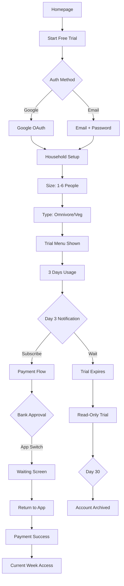
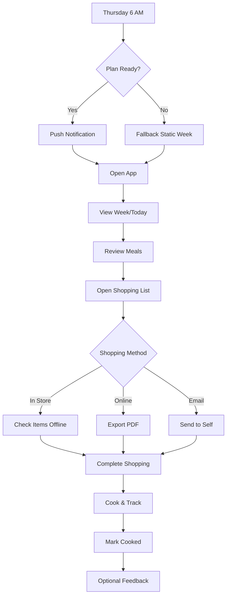
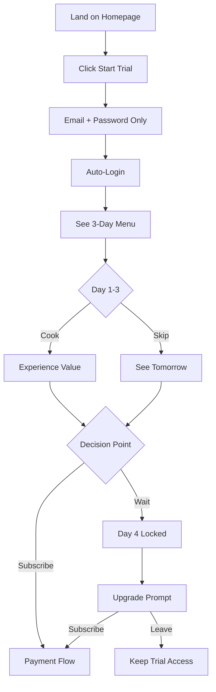
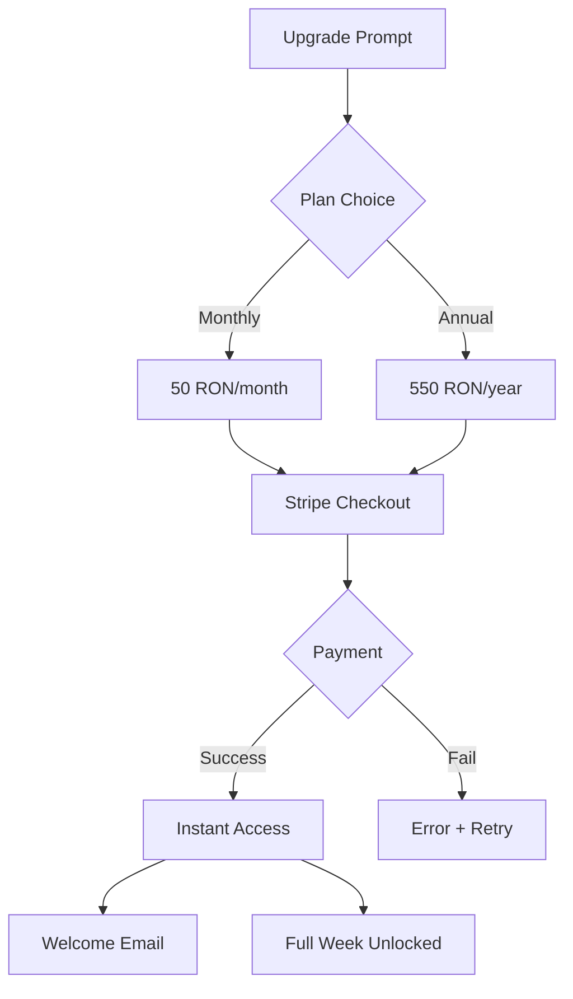
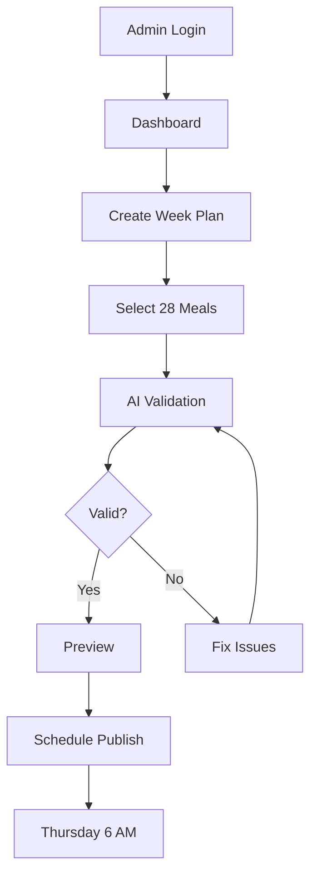

# User Flows

## Critical User Flows

### Flow 1: Trial to Paid Conversion

**User Goal:** Experience value and decide to subscribe
**Entry Points:** Homepage CTA, Marketing pages, Word of mouth
**Success Criteria:** User completes payment and accesses current week

**Flow Diagram:**

**Edge Cases:**

- Payment fails → Show retry with different method
- Bank app doesn't return → Check webhook, email confirmation
- Multiple trial attempts → Block by email AND device fingerprint
- Zombie accounts → Auto-archive after 30 days inactive

**Critical Implementation Notes:**

- Single session only - new login kicks out other devices
- Payment success page must work even with lost session
- Static backup week ready if Thursday publishing fails

### Flow 2: Weekly Meal Planning Routine

**User Goal:** Get plan, shop efficiently, cook, track progress
**Entry Points:** Thursday notification, Direct app access
**Success Criteria:** Shopping done, meals cooked, feedback given

**Flow Diagram:**

**Edge Cases:**

- Plan publishing fails → Serve last week's plan with "Updated plan coming" notice
- Offline in store → PWA works with cached data
- PDF fails → "Email yourself" fallback
- Forgot to mark cooked → No penalties, just lose tracking

**Session Management:**

- One active session per account
- "Logged in elsewhere" message if kicked out
- Remember week view preference

### Flow 3: Free Trial Experience

**User Goal:** Experience value quickly, convert to paid
**Entry Points:** Landing page, Social media ads
**Success Criteria:** Convert within 3 days or understand value

**Flow Diagram:**

**Key Design Decisions:**

- No onboarding survey (immediate value)
- 3 curated days shown immediately
- Trial menu remains forever accessible (gift)
- Day 4 shows locked state clearly

### Flow 4: Subscription & Payment

**User Goal:** Start paid subscription
**Entry Points:** Trial day 4, Upgrade buttons
**Success Criteria:** Active subscription

**Flow Diagram:**

**Payment Handling:**

- Stripe hosted checkout (no PCI compliance needed)
- Support Romanian cards + PayPal
- Clear pricing in RON
- Instant activation

### Flow 5: Admin Meal Planning

**User Goal:** Create weekly meal plan efficiently
**Entry Points:** admin.coquinate.ro
**Success Criteria:** Published plan with no errors

**Flow Diagram:**

**Admin Safeguards:**

- AI checks for variety/balance
- Leftover flow validation
- Preview before publish
- Rollback capability
